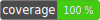

# Strict Types Form Request Validation



[](https://packagist.org/packages/nwilging/laravel-strict-types-validation)
[](https://packagist.org/packages/nwilging/laravel-strict-types-validation)
[](https://packagist.org/packages/nwilging/laravel-strict-types-validation)

Ensures incoming form request data is a certain datatype.

---

### About

While Laravel includes many useful validation rules out of the box, [it lacks the ability to validate _data type_ as well
as _content type_](https://laravel.com/docs/9.x/validation#rule-integer). There have been a [couple](https://github.com/laravel/framework/issues/18918)
[complaints](https://github.com/laravel/ideas/issues/1719) about this over the years, but due to the versatile nature of
Laravel, it doesn't seem likely that validation rules such as `integer` or `boolean` will begin validating that the data
is actually of the desired type.

This package provides a way for you to require the incoming data to be of a given type, such as `int`, `bool`, `float`, etc.

---

# Installation

### Pre Requisites
1. Laravel v8+
2. PHP 7.4+

### Install with Composer

```
composer require nwilging/laravel-strict-types-validation
```

---

# Usage

When constructing validation rules, simply add `type:<desired type>` to the validation rules string/array.

```
$rules = [
    'id' => 'required|type:int', # This will require the incoming `id` to be an integer.
];
```

### Failure Messages

The failure message format is:
```
The :attribute must be of type :type
```

Where `attribute` is the attribute being validated (`id` from the above example) and `type` is the desired type to validate
against (`int` in the above example).

If the above example failed, we would receive this message:
```
The id must be of type int
```
